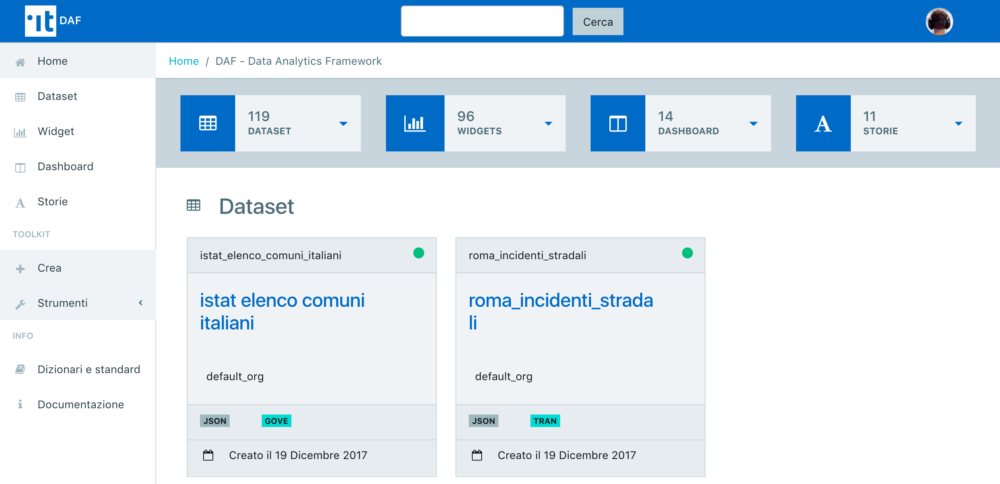

Dataportal: area privata
========================

L'area privata del Dataportal è disponibile all'indirizzo `dataportal-private.daf.teamdigitale.it <https://dataportal-private.daf.teamdigitale.it/>`__. 

Gli utenti hanno la possibilità di registrarsi per avere accesso all'area privata del Dataportal e, conseguentemente, agli strumenti di analisi messi a disposizione dalla piattaforma.

   Area privata del Dataportal.

L'idea è quella di fornire alle Pubbliche Amministrazioni e alla community di utilizzatori uno stesso insieme di strumenti per l'analisi e l'accesso ai dati contenuti nel DAF, chiaramente preservando i diritti di accesso associati alle varie utenze.

Dopo aver effettuato la `registrazione e il login <registrazione-login/index.html>`__, nell'area privata è possibile [1]_:

* Accedere al cruscotto utile alla `registrazione di nuovi dataset <gestionedataset/index.html>`_. La procedura guidata facilita una completa metadatazione in conformità al profilo DCAT-AP_IT; i metadati sono arricchiti con informazioni sulla struttura del dato e relativa semantica [2]_.

* Creare e pubblicare Data Story, ovvero dei blog post in cui è possibile inserire nativamente risultati di analisi svolte con gli strumenti messi a disposizione dal DAF.

* Creare e pubblicare Dashboard, ovvero un insieme di grafici creati con gli strumenti messi a disposizione dal DAF.

* Utilizzare `Jupyter Notebook <jupyter/index.html>`_ integrato con il cluster big data del DAF, con cui effettuare analisi esplorative iniziali fino a complessi modelli di machine learning.

* Accedere allo `strumento di business intelligence (Superset) <superset/index.html>`_ e strumenti più orientati alla `data visualization (Metabase) <metabase/index.html>`_. I risultati delle analisi svolti con questi strumenti possono essere integrati nativamente nelle Data Story e nelle Dashboard.

.. rubric:: Operazioni e strumenti dell'area privata del Dataportal

.. toctree::
   :maxdepth: 1
   
   Registrazione e login <registrazione-login/index>
   Gestione dei dataset <gestionedataset/index>
   Jupyter Notebook <jupyter/index>
   Superset <superset/index>
   Metabase <metabase.rst>

.. [1] Elenco non esaustivo e in evoluzione.
.. [2] Al momento questa funzionalità è offerta solo alle Pubbliche Amministrazioni
